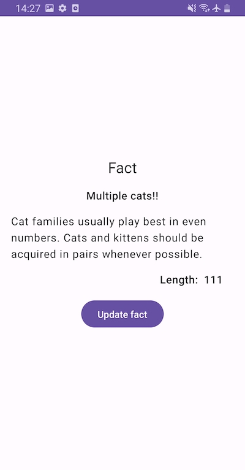

# Before you start
### About the tasks and the descriptions
A description of each task in this challenge is not very specific and strict. To be honest, we don't think we're providing perfect requirements.

If you have better idea (more effective, efficient, creative etc), it's  more than welcome, so let's ignore the descriptions and implement in your way 👍

### Library and framework
If you haven't used a library before, (Jetpack Compose, for example) or not confident enough, it's okay!

You can either
- Skip & go alternative solution (`databinding` instead of Jetpack Compose, for example)
- Spend some time to learn, and try to use it

Nevertheless, it's recommended to **quickly learn a new thing** since each task is simple in this challenge.

### Time
**We don't set the time limitation**. You can take your time. Please take it easy ✌🏻

But at the same time, we don't wouldn't like you to spend a lot of time because we don't want to consume your valuable time.

The below is approximate time for each task group.
- 1~2 hours on `TODO`
- 2~3 hours on `Optional`

Optional requirements are optional, literally.  Please do them only if you can spend more time.

# Tasks - Fact app
This app shows a fact via [fact free api](https://catfact.ninja/fact).

## Issues
It works, but does not satisfy some requirements.

Please implement TODOs!

If you have time after finishing TODOs, please check & try [Optional](#optional).

### TODO
- Access data via `Data layer`
- Add local data source using [Jetpack DataStore](https://developer.android.com/topic/libraries/architecture/datastore)
- Add dependency injection by `Hilt`
- Show the `length` from the api response below the `fact` content *only when*
  the `length` is greater than 100
- Show the text "Multiple cats!" when the `fact` contains the word `cats`
  - No context check is required, simply finding the worked `cats` is fine
- Make the UI state immutable as much as possible
- Add unit or UI tests depending on your code

---
#### Example screenshot after implementing TODOs

---

### Optional
If you have time and want to do more, please
- (Design) Add the `Top app bar` and update the design as you want 🏰
- (Testing) Add [JUnit5](https://github.com/mannodermaus/android-junit5) and `fake` or `mockk`
- (Gradle) Add a `version catalog` 📗
- (Future growth) `Modularize` the app ✌🏻
- (Future growth) Add `Domain layer` 🚴‍️

## To submit your solution
Please
- Fork this repo ⑂
- Create a pull request in your own repo 📝
  - ❌ Please do not create one in this repo
- Send your the pull request's link to us 🙏
  - We would like to leave some comments for the next step
